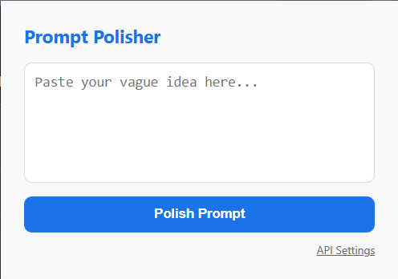

# 🗜️ Prompt Enhancer Extension

[](https://opensource.org/licenses/MIT)
[](https://developer.chrome.com/docs/extensions/mv3/)
[](https://ai.google.dev/)

A robust, standalone Chrome/Edge browser extension that leverages the power of Google's Gemini 2.5 Flash model to instantly transform vague ideas and raw thoughts into highly structured, professional engineering prompts. 

Eliminate context switching and supercharge your AI workflows without ever leaving your current browser tab.



---

## 🚀 The Problem it Solves

In the era of Generative AI, the quality of your output is entirely dependent on the quality of your input. However, crafting the perfect prompt requires time, structure, and careful phrasing. 

**"Context switching" kills productivity.** If you are deep in a coding session, writing an important email, or drafting a project proposal, having to open a new tab, navigate to an AI chatbot (like ChatGPT or Claude), type "make this prompt better", copy the result, and paste it back into your workspace completely breaks your cognitive flow.

**Prompt Enhancer** solves this by acting as your personal, on-demand Prompt Engineer residing directly in your browser toolbar. Paste your raw, unfiltered thoughts, click a button, and receive a world-class, context-rich prompt back in seconds.

---

## 💡 Core Features

*   ⚡ **Instant Access:** Always available in your browser toolbar for frictionless prompt engineering.
*   🧠 **Powered by Gemini 2.5 Flash:** Utilizes Google's state-of-the-art, lightning-fast model to analyze intent and generate high-fidelity, structured prompts.
*   🔑 **Bring Your Own Key (BYOK) Architecture:** 100% free to use. This extension requires no subscription. You simply provide your own free Gemini API key.
*   🛡️ **Privacy First & Secure:** Your API key is stored locally and securely within your browser's `chrome.storage.local`. The extension communicates *directly* with the Google API endpoints. There are no middleman servers, telemetry, or data tracking.
*   🎨 **Specialized Output:** Converts simple sentences into structured formats encompassing Role, Task, Context, Constraints, and Output Format.
*   🧩 **Manifest V3 Compliant:** Built using the latest and most secure extension standards mandated by modern browsers.

---

## 🏗️ Architecture & Tech Stack

This project was built with a focus on simplicity, security, and performance.

*   **Frontend:** HTML5, CSS3, Vanilla JavaScript (No heavy frameworks required)
*   **Extension Framework:** Manifest V3 (MV3) Service Workers
*   **AI Integration:** Google Gemini API (`generativelanguage.googleapis.com`)
*   **Model:** `gemini-2.5-flash`
*   **Data Persistence:** `chrome.storage.local` API

---

## 📥 Installation Guide

Because this extension is open-source and respects your privacy, it is currently loaded as an "unpacked" extension. It works flawlessly on Google Chrome, Microsoft Edge, Brave, and other Chromium-based browsers.

### Step-by-Step Installation:

1.  **Clone the Repository:**
    ```bash
    git clone https://github.com/yourusername/PromptEnhancerExtension.git
    ```
    *(Alternatively, download the repository as a ZIP file and extract it).*

2.  **Open Extension Management:**
    *   **Chrome:** Type `chrome://extensions` in your address bar and hit Enter.
    *   **Edge:** Type `edge://extensions` in your address bar and hit Enter.

3.  **Enable Developer Mode:**
    *   Locate the **"Developer mode"** toggle (usually in the top right corner) and turn it **ON**.

4.  **Load the Extension:**
    *   Click the **"Load unpacked"** button that appears.
    *   Navigate to the directory where you cloned/extracted the project and select the `PromptEnhancerExtension` folder.

5.  **Pin it:**
    *   Click the puzzle piece icon (Extensions menu) in your browser toolbar and "Pin" the Prompt Polisher icon for easy access.

---

## ⚙️ Configuration & Usage

To use the extension, you need a free Gemini API key.

1. **Get a Free API Key**
    *   Navigate to [Google AI Studio](https://aistudio.google.com/app/apikey).
    *   Sign in with your Google account.
    *   Click **"Create API key"** and copy the generated key.

2. **Configure the Extension**
    *   Click the Prompt Polisher icon in your browser toolbar to open the popup.
    *   Click the **"API Settings"** link located at the bottom right.
    *   Paste your Gemini API key into the input field.
    *   Click **"Save Key"**. You will see a success confirmation, and the key is now securely stored locally.

3. **Polish Your Prompts!**
    *   Open the extension popup.
    *   Paste a vague or raw idea into the text area. 
        *   *Example: "I want a python script to rename all files in a folder to lowercase and replace spaces with underscores."*
    *   Click **"Polish Prompt"**.
    *   In seconds, the output box will display a highly detailed, structured prompt ready to be fed into any AI model for superior results.

---

## 🤝 Contributing

Contributions, issues, and feature requests are highly encouraged! This project thrives on community feedback.

1.  Fork the Project
2.  Create your Feature Branch (`git checkout -b feature/AmazingFeature`)
3.  Commit your Changes (`git commit -m 'Add some AmazingFeature'`)
4.  Push to the Branch (`git push origin feature/AmazingFeature`)
5.  Open a Pull Request

---

## 📄 License

Distributed under the MIT License. See `LICENSE` for more information.

---
*Architected and developed with ❤️ by Sharda Vatsal Bhat*
